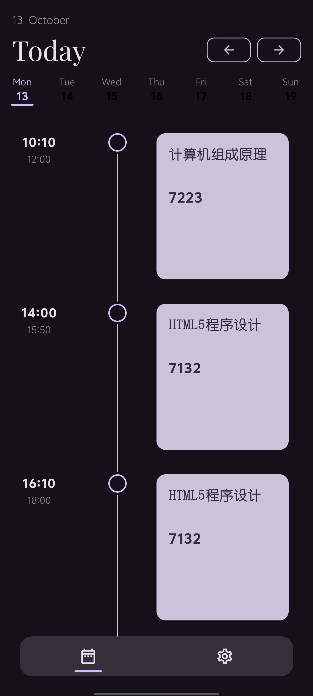
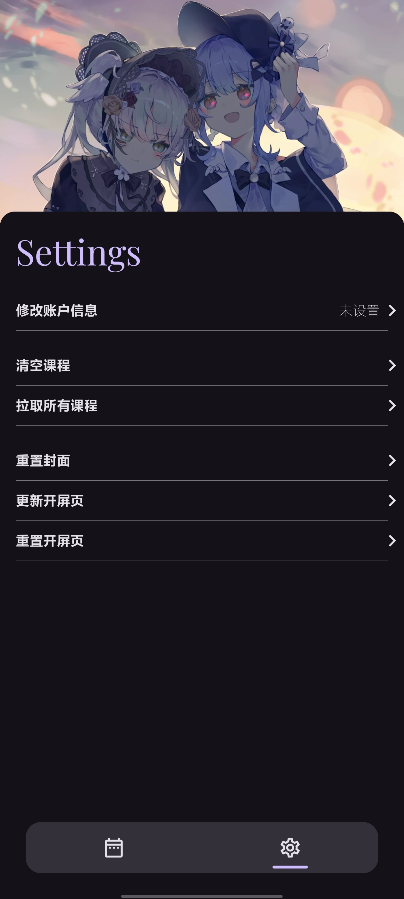

<div align="center">
  
  <p>
    <a href="LICENSE"></a>
    <a href="https://kotlinlang.org"></a>
    <a href="https://developer.android.com/jetpack/compose"></a>
    <a href="https://developer.android.com/topic/architecture"></a>
    <a href="https://github.com/ci-eytools/ey-wfu-schedule/stargazers"></a>
  </p>
</div>

---

> **Seduley** 是一款专为潍院学生打造的、功能强大的现代化 Android 校园课表应用。  
> 它旨在提供一个美观、简洁且高效的方式来查看和管理课程表，  
> 并采用了业界最新的 Android 技术栈与 Clean Architecture 设计思想，实现高可维护性与扩展性。

---

## ✨ 核心功能

- **智能数据同步**  
  自动登录教务系统，安全抓取并解析课程表数据。

- **AI 验证码识别**  
  集成本地 TensorFlow Lite 模型，自动识别验证码，登录过程更便捷。

- **响应式课程视图**  
  基于 Jetpack Compose 构建的动态课程 UI，支持每日 / 每周视图与流畅动画。

- **强大的后台任务系统**
  - **每日课程提醒**：每天定时发送通知，提醒次日课程安排。
  - **课表自动更新**：后台静默同步教务系统最新课表，无需手动操作。
  - **持久化调度**：重启设备后，所有定时任务将自动重新注册，保证服务可靠性。

- **离线优先**  
  所有课程、配置信息持久化到本地 Room 数据库，无网络也可使用。

- **全面的权限管理**
  集中的权限配置中心，动态展示权限状态（通知、精确闹钟、电池优化等），并引导用户开启。

- **企业级安全保障**
  - **硬件级加密**：使用 Android KeyStore + Jetpack Security (Crypto) 对凭证加密存储。
  - **安全网络通信**：全程 HTTPS 加密传输，保障数据安全。
  - **代码混淆**：启用 ProGuard 对发布版本进行代码混淆和资源压缩，增强反编译难度。

- **个性化主题**
  - 支持浅色 / 深色模式，智能跟随系统。
  - Android 12+ 支持 Material You 动态取色，与封面壁纸联动。

---

## 📸 应用截图

| 每日视图 | 设置页面 |
| :---: | :---: |
|  |  |

---

### 📸 图片来源 / Image Credits

**开屏与封面** : [@MaidCode1023/www.bilibili.com](https://space.bilibili.com/85754376)

---

## 🛠 技术栈与架构

Seduley 基于 Google 官方推荐的 Android 现代化技术栈构建，严格遵循 Clean Architecture 设计思想。

### 🌿 核心语言
- **Kotlin** — 100% Kotlin 编写，使用 **Coroutines** 与 **Flow** 实现响应式数据流。

### 🎨 UI 层
- **Jetpack Compose** — 声明式 UI，支持动画、动态主题与可组合组件。

### 🧩 架构模式
- **MVVM** — 将 UI 与业务逻辑分离，便于维护与测试。  
- **Clean Architecture** — 分为 `data` / `domain` / `presentation` 三层，实现高度解耦。

### ⚙️ 依赖注入
- **Hilt (Dagger)** — 管理依赖生命周期，简化组件注入。

### 🗃 数据存储
- **Room** — 本地结构化课程数据存储，支持编译时 SQL 校验与唯一性约束，防止数据重复。  
- **DataStore** — 安全高效地存储用户凭证与系统配置，替代 SharedPreferences。

### 🔒 安全
- **Android KeyStore + Jetpack Security Crypto** — 硬件加密存储登录凭证。
- **ProGuard** — 对 Release 版本进行代码混淆与资源压缩。

### 🌐 网络与解析
- **自定义网络层 + Jsoup** — 高效抓取与解析教务系统 HTML 页面。  

### 🤖 机器学习
- **TensorFlow Lite** — 设备端运行轻量级验证码识别模型。  

### ⏰ 后台任务与调度
- **AlarmManager** — 精确调度每日提醒、课表更新等后台任务。
- **BroadcastReceiver** — 接收系统广播（如设备启动），保证任务的持久性。

---

## 🌟 核心重构亮点

- **原子性的闹钟管理**: 通过引入统一的 `AlarmController` 和利用 Room 的**唯一性约束 (Unique Index)** 与 **`OnConflictStrategy.IGNORE`** 策略，从根本上解决了并发环境下重复创建后台任务的问题，保证了任务的原子性。
- **响应式系统配置**: 创建了独立的 `SystemConfiguration` 领域层，使用 `StateFlow` 将用户设置（如是否开启每日提醒）与后台任务的注册/注销逻辑响应式地连接起来，实现了配置驱动的自动化后台管理。
- **声明式权限处理**: 在设置页中，UI能够动态地监听并反映系统权限的实时状态，并结合 `LifecycleObserver` 在用户从系统设置返回后智能地刷新界面，提升了交互体验。

---

## 🧱 项目结构

```

com.atri.seduley
├─ core                # 核心模块 (网络、加密、ML模型、工具类、基础实体等)
├─ di                  # Hilt 依赖注入配置模块
├─ feature             # 按功能划分的业务模块
│  ├─ course           # 课程功能模块 (课表、登录、数据同步)
│  │  ├─ data          # 数据层: Repository 实现、DAO、DTO、网络源
│  │  ├─ domain        # 领域层: UseCases 与核心模型
│  │  └─ presentation  # 表现层: Compose UI、ViewModel、UI State
│  ├─ setting          # 设置模块
│  └─ ...              # 可扩展功能模块
└─ ui
└─ theme            # 全局主题与样式定义

````

### 分层说明

- **presentation 层**：负责 UI 展示与用户交互，响应 ViewModel 状态。  
- **domain 层**：封装业务逻辑与模型，不依赖 Android 框架，可单元测试。  
- **data 层**：屏蔽数据来源差异（网络 / 本地），提供统一接口给上层。

---

## 🚀 构建与运行

### 环境要求
- **Android Studio Iguana | 2023.2.1** 或更高版本  
- **JDK 17**  
- **Gradle 8+**

### 构建步骤

1. **克隆项目**
```bash
   git clone https://github.com/ci-eytools/ey-wfu-schedule.git
   cd ey-wfu-schedule
````

2. **导入工程**
   使用最新稳定版 Android Studio 打开项目根目录。

3. **构建与运行**

   * 在工具栏选择 `app` 配置。
   * 点击 ▶️ `Run 'app'` 启动模拟器或真机调试。

### ⚠️ 注意事项

> 本应用的登录与数据解析逻辑适用于特定教务系统。
> 若需适配其他系统，请调整以下内容：

1. 修改 `core/network/ApiUrls.kt` 的接口端点。
2. 调整 `feature/course/data/repository/InitInfoRepositoryImpl.kt` 中的 `parseCourseHtml()` 方法以适配新 HTML。
3. 若验证码样式不同，请重新训练或替换 `core/ml/CaptchaModel`。

---

## 🤝 贡献指南

欢迎任何形式的贡献！
如发现 Bug 或有新功能建议，请在 [Issues](https://github.com/ci-eytools/ey-wfu-schedule/issues) 中提出。

### 提交流程

1. Fork 本仓库
2. 新建分支

   ```bash
   git checkout -b feature/YourAmazingFeature
   ```
3. 提交修改

   ```bash
   git commit -m 'feat: Add some amazing feature'
   ```
4. 推送分支

   ```bash
   git push origin feature/YourAmazingFeature
   ```
5. 创建 Pull Request 并说明变更内容

---

## 📄 许可证

详情请查阅 [](LICENSE) 文件。

---
