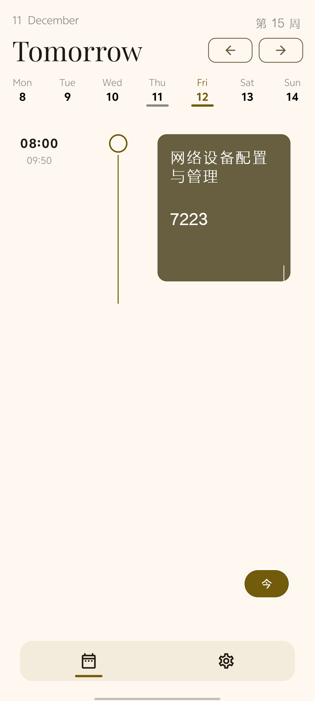
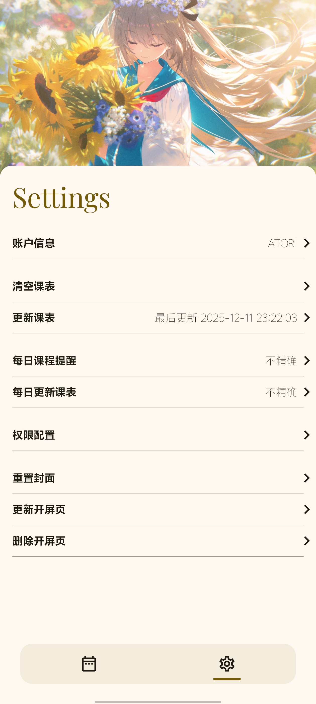
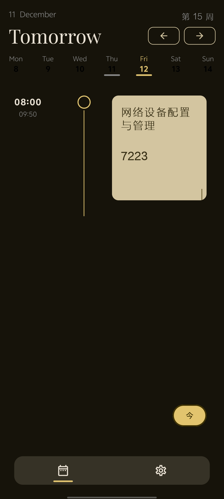
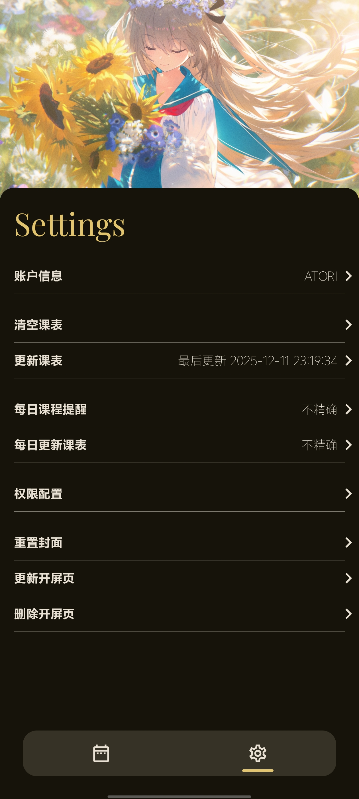

<div align="center">
  
  <p>
    <a href="LICENSE"></a>
    <a href="https://kotlinlang.org"></a>
    <a href="https://developer.android.com/jetpack/compose"></a>
    <a href="https://developer.android.com/topic/architecture"></a>
    <a href="https://github.com/ci-eytools/ey-wfu-schedule/stargazers"></a>
  </p>
</div>

---

> **Seduley** 是一款专为潍院学生打造的现代化 Android 课表 App。
> 提供美观、简洁、高效的课程管理体验，并基于最新 Jetpack 技术构建。
> 同时支持 **多用户系统**、**后台任务调度体系**。

---

# ✨ 核心功能

* **智能数据同步**
  * 自动登录教务系统
  * 安全抓取 / 解析课程表数据

* **AI 验证码识别**
  * 本地 TensorFlow Lite 模型
  * 免手动输入验证码（高效稳定）

* **响应式课程视图**
  * Jetpack Compose 动态课程 UI
  * 日视图 / 周视图 + 平滑动画

* **多用户支持（亮点）**
  * 多账户独立本地数据（Room 多用户存储）
  * DataStore 多用户凭据隔离
  * 支持随时切换使用者

* **后台任务系统（亮点）**
  * 每日课程提醒
  * 静默自动更新课表
  * 重启设备自动恢复任务（持久化调度）

* **离线优先**
  * 所有课程数据落地 Room
  * 无网也可完整使用

* **权限管理中心**
  * 提醒用户打开通知、后台、精确闹钟等关键权限

* **安全**
  * Android KeyStore + Jetpack Crypto 加密凭证
  * HTTPS 全链路安全传输
  * ProGuard 混淆增强安全

* **个性化主题**
  * 明暗模式
  * Material You 动态取色（Android 12+）

---

# 📸 应用截图

|                              每日视图                             |                          设置页面                         |
| :-----------------------------------------------------------: | :---------------------------------------------------: |
|      |      |
|  |  |

---

### 📸 图片来源 / Image Credits

封面图来源：
[https://www.pixiv.net/artworks/137483887](https://www.pixiv.net/artworks/137483887)

---

# 🛠 技术栈

Seduley 基于 Google 官方推荐的 Android 现代化技术栈构建

## 🌿 核心语言

* **Kotlin 全量开发**
* 使用 **Coroutines** + **Flow** 进行异步与响应式处理

## 🎨 UI 层

* **Jetpack Compose** 声明式 UI
* 动画、动态主题、可组合组件

## 🧩 架构模式

* **MVVM**
* **Clean Architecture 三层分离：**
  * `data` 数据层（DB / 网络 / ML 实现）
  * `domain` 领域层（业务规则、UseCase）
  * `presentation` UI 层（ViewModel + Compose）

## ⚙️ 依赖注入

* **Hilt (Dagger)** 管理所有依赖生命周期

## 🗃 数据存储

* **SharedPreferences**（快速加载初始数据）
* **Room 数据库**（支持多用户、编译期 SQL 校验）
* **DataStore**（安全存储凭证、系统参数）
* **Android KeyStore + Crypto**（硬件加密）

## 🌐 网络

* **自定义网络层 + Jsoup** 用于解析教务系统 HTML

## 🤖 机器学习

* **TensorFlow Lite**
* ML 模块设计为 **可插拔结构**

## ⏰ 后台任务

* **AlarmManager** 定时
* **BroadcastReceiver** 保证任务重启恢复

---

# 🌟 核心重构亮点

* **多用户系统完整支持**
  * 本地数据库多用户 Course/Task/Student 分离
  * DataStore 凭证隔离
  * 随时切换账户不会互相影响

* **可插拔的 ML 体系**
  * 当前使用 TFLite
  * 未来可切换为 Go / JNI / NCNN 版本

* **统一的后台任务调度中心**
  * 自动恢复调度
  * 原子化任务注册
  * 避免重复提醒或忘记执行

* **网络层全重构**
  * 统一请求 Helper
  * 独立拦截器链
  * 灵活扩展 API

---

# 📁 项目目录结构（主工程）

```markdown
src
├── androidTest/               # Android 仪器化测试代码
├── main/                      # 主应用程序代码
│   ├── assets/                # 原始资源文件（模型文件等）
│   ├── java/com/atri/seduley/ # 应用主包
│   │   ├── core/              # 核心功能模块（网络、通知、工具类等）
│   │   │   ├── alarm/         # 闹钟调度和提醒功能
│   │   │   ├── network/       # 网络请求和API通信
│   │   │   ├── notification/  # 通知管理功能
│   │   │   └── util/          # 通用工具类
│   │   ├── data/              # 数据层（本地存储和远程数据）
│   │   │   ├── local/         # 本地数据存储（数据库、DataStore）
│   │   │   ├── remote/        # 远程数据源（API接口定义）
│   │   │   └── repository/    # 数据仓库实现
│   │   ├── di/                # 依赖注入模块配置
│   │   ├── domain/            # 领域层（业务逻辑和模型）
│   │   │   ├── model/         # 业务数据模型定义
│   │   │   ├── repository/    # 数据仓库接口定义
│   │   │   └── usecase/       # 业务用例（Use Case）
│   │   └── ui/                # 展示层（Compose UI组件）
│   │       ├── components/    # 可复用UI组件
│   │       ├── navigation/    # 应用路由管理
│   │       ├── screen/        # 页面级UI组件
│   │       ├── theme/         # 应用主题和样式
│   │       └── viewmodel/     # 界面状态管理
│   └── res/                   # 标准Android资源（图片、字符串等）
```

---

## 🚀 构建与运行

### 环境要求
- **Android Studio Iguana | 2023.2.1** 或更高版本  
- **JDK 17**  
- **Gradle 8+**

### 构建步骤

1. **克隆项目**
```bash
   git clone https://github.com/ci-eytools/ey-wfu-schedule.git
   cd ey-wfu-schedule
````

2. **导入工程**
   使用最新稳定版 Android Studio 打开项目根目录。

3. **构建与运行**

   * 在工具栏选择 `app` 配置。
   * 点击 ▶️ `Run 'app'` 启动模拟器或真机调试。

### ⚠️ 注意事项

> 本应用的登录与数据解析逻辑适用于特定教务系统。
> 若需适配其他系统，请调整以下内容：

1. 修改 `core/network/ApiUrls.kt` 的接口端点。
2. 调整 `feature/course/data/repository/InitInfoRepositoryImpl.kt` 中的 `parseCourseHtml()` 方法以适配新 HTML。
3. 若验证码样式不同，请重新训练或替换 `core/ml/CaptchaModel`。

---

## 🤝 贡献指南

欢迎任何形式的贡献！
如发现 Bug 或有新功能建议，请在 [Issues](https://github.com/ci-eytools/ey-wfu-schedule/issues) 中提出。

### 提交流程

1. Fork 本仓库
2. 新建分支

   ```bash
   git checkout -b feature/YourAmazingFeature
   ```
3. 提交修改

   ```bash
   git commit -m 'feat: Add some amazing feature'
   ```
4. 推送分支

   ```bash
   git push origin feature/YourAmazingFeature
   ```
5. 创建 Pull Request 并说明变更内容

---

## 📄 许可证

详情请查阅 [](LICENSE) 文件。

---
